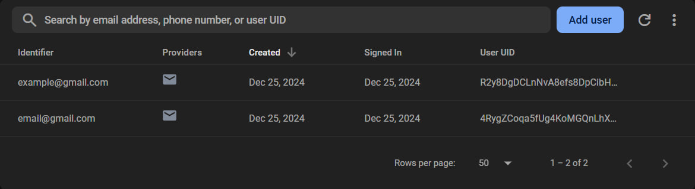
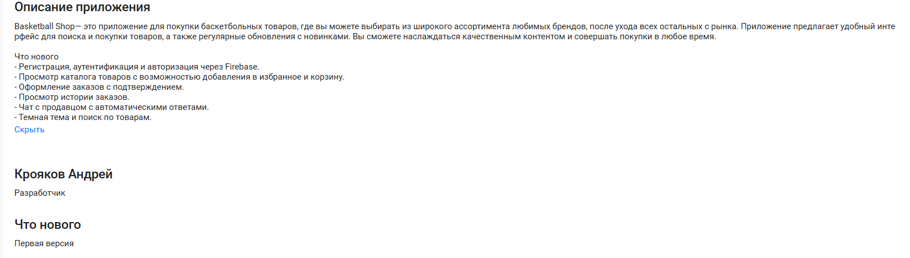
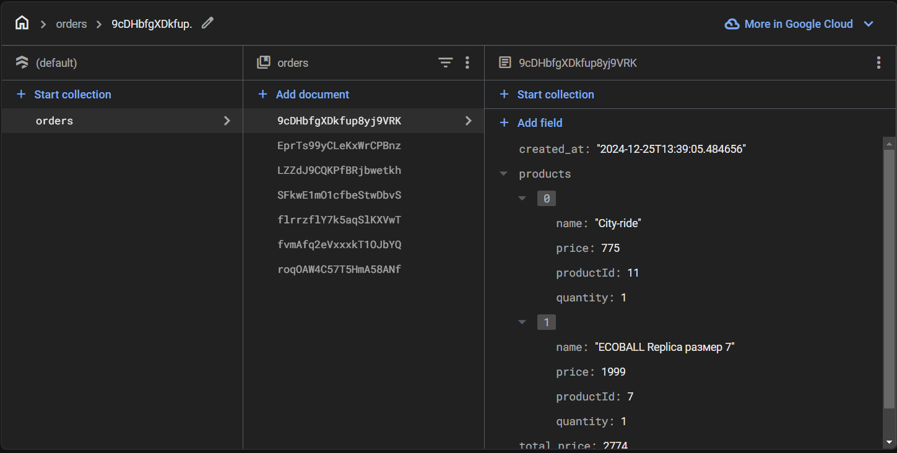

# Практическая работа №13 использование firebaseдля Идентификации, аутентификкации, авторизации

# Редактирование данных профиля

# Регистрация нового аккаунта

# Синхронизация с firebase

# Оформление заказов через firebase

